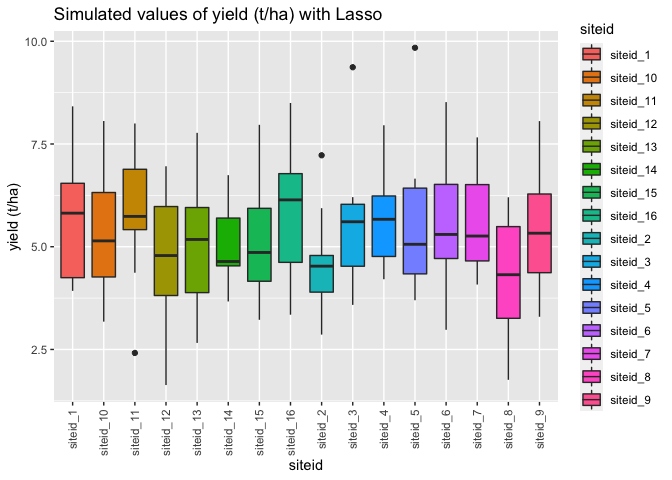

<!-- README.md is generated from README.Rmd. Please edit that file -->

# InnoVaR

<!-- badges: start -->


<!-- badges: end -->

InnoVar is an R-package for simulating Multi Environmental Trials in a
modular manner. The package allows for simulation of continous
correlated and categorial associated variables considering different
continuous and categorical marginal distributions.

## Installation

You can install the development version from
[GitHub](https://github.com/danilosarti/InnoVar) with:

``` r
#install.packages("devtools")
#devtools::install_github("danilosarti/InnoVaR")
```

You can then load the package with:

``` r
library(InnoVaR)
```

# MET simulations

You can simulate a MET obtaining a dataset like the one below. Details
can be found in the vignette with the package flow in the Articles
section.

``` r
load("/Volumes/T7 Touch/InnoVaR/data/final_soil_gen.rda")
```

``` r
head(final_soil_gen[c(1:3),c(1,5,100,102,103)])
#>     siteid trait_4 trait_99   genotype_id       DranaigeClass
#> 1 siteid_1       0        2 genotype_id_1 Imperfectly drained
#> 2 siteid_1       2        2 genotype_id_2 Imperfectly drained
#> 3 siteid_1       0        0 genotype_id_3 Imperfectly drained
```

# Simulating phenomics

You can generate phenomic responses using different methods like Lasso,
AMMI models and Gilberg (2019)

``` r
library(dplyr)
dat <- final_soil_gen %>%
  dplyr::mutate_if(is.character, as.factor)
```

``` r
library(InnoVaR)
target <- sim_target(
   X_gene = dat %>% dplyr::select(`trait_1`:`trait_100`),
   X_env = dat %>% dplyr::select(`DranaigeClass`:`yes_no_sample`),
   method = "lasso", pars = list(lambda = 0.2, sigma = 1),
   marginal_mean = 5.3, marginal_sd = 1.5
 )
```


